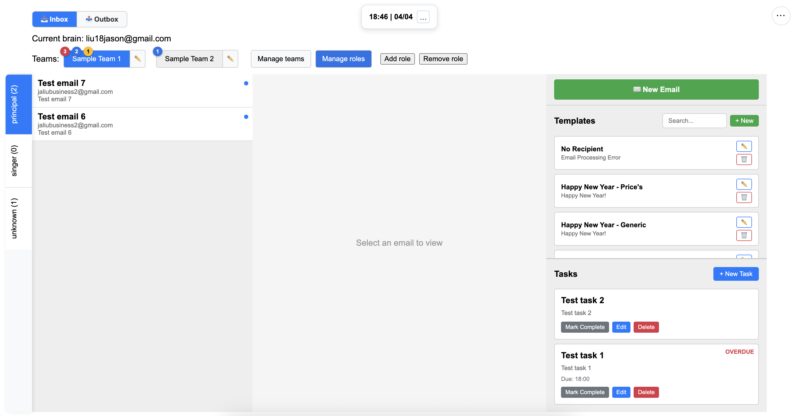
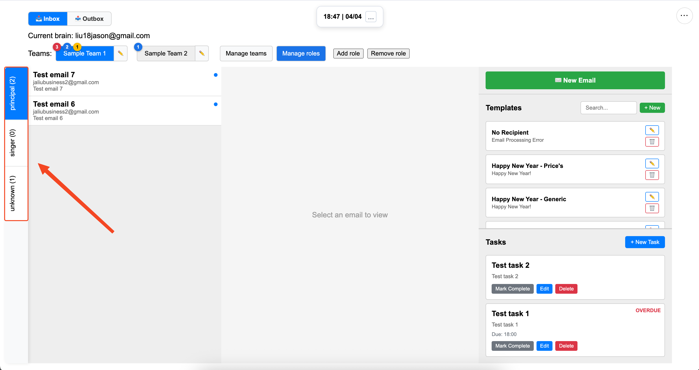
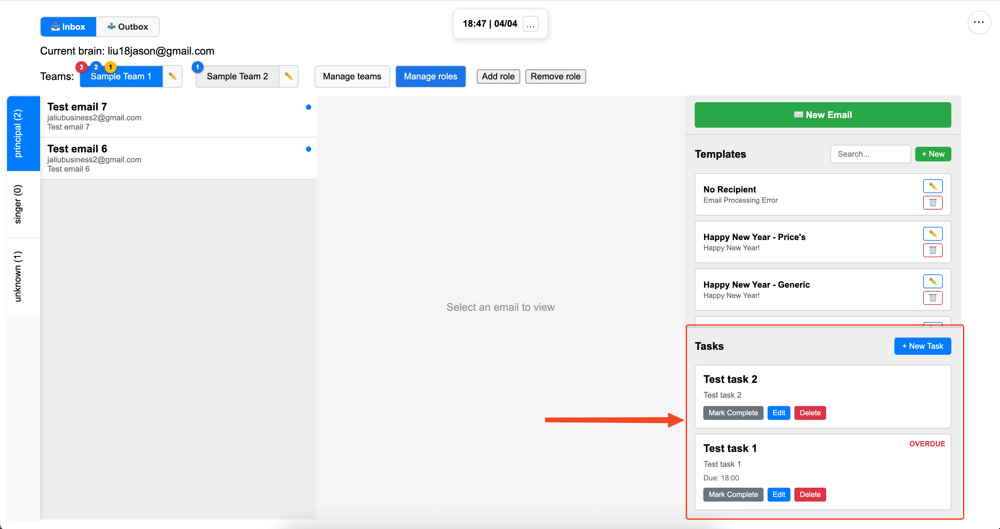
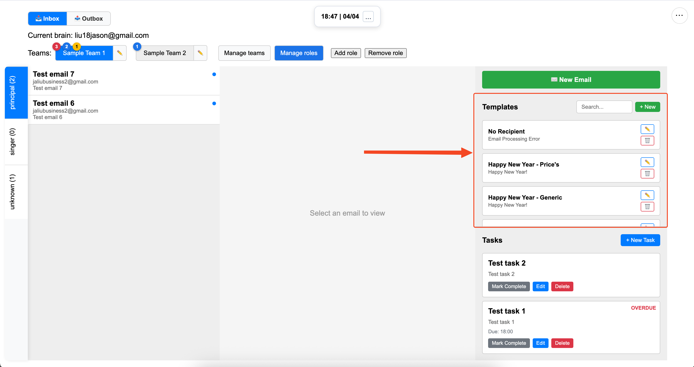
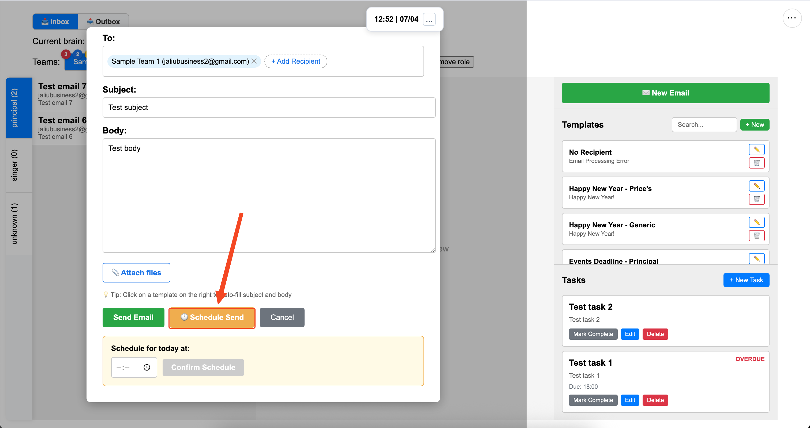
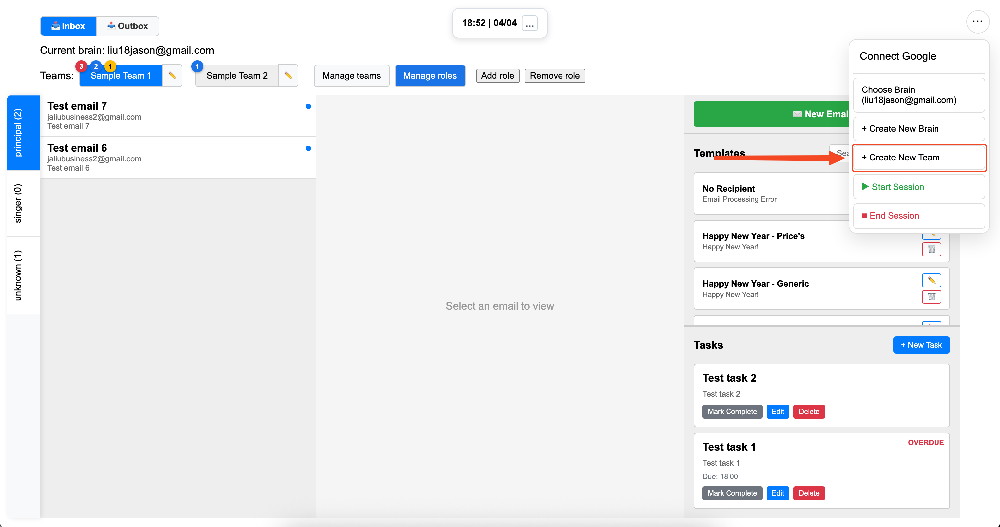
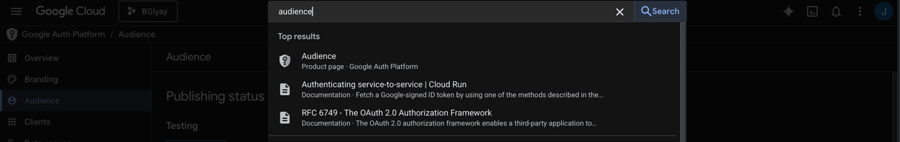
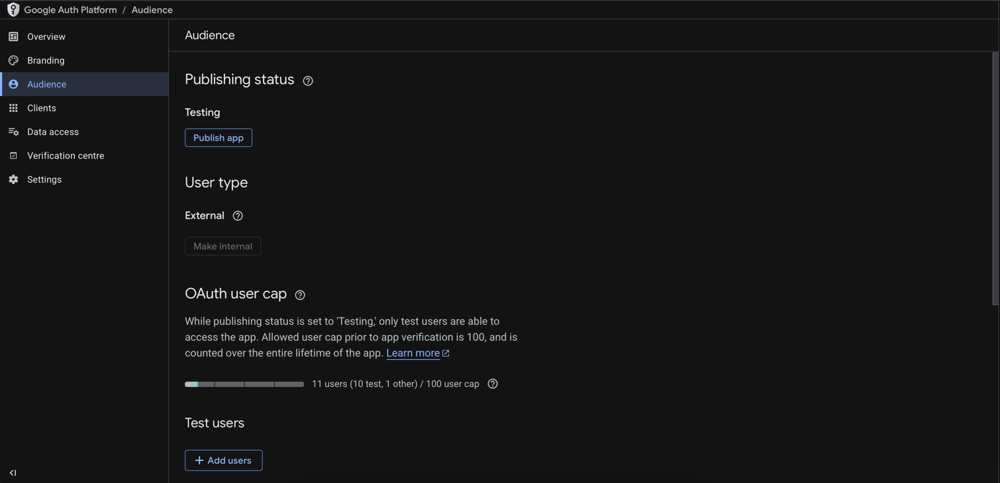

# Brain Game Interface User Guide

## Overview

The Brain Game Interface is an application designed to support facilitators of the Bridge21 Brain Game Workshop. 
You can log in with a brain email (e.g. drbrain@ta21.ie) and send/receive emails.
At the start of a session, you choose the brain email to play for this session, click start session, and assign teams (e.g. pod1@bridge21.ie) to you.

One of the biggest improvements is that inboxes are no longer shared across teams.  
Instead, each team assigned to you has its own inbox in your interface. Click any assigned team to open its inbox (see Sample Team 1 / Sample Team 2 above).

Within each team, you can create **roles**.  
Roles act as sub-inboxes for the different stakeholders you are playing (for example, `principal`). When you create a role, you give it a name, and any email that contains that name (e.g., `principal`) in the subject or first line of the body is automatically routed to that role.

If an email does not match any role (for example: typo, missing stakeholder, or no roles configured), it goes to the **Unknown** role by default. This serves as a catch-all fallback.

You can also change an email’s role manually at any time: open the email and click **Move to role**.  
For example, if someone writes `principla`, it will land in Unknown, but you can move it to `principal`.

There are a bunch of other features, such as scheduling emails, managing tasks (with due time), managing templates, etc. See below. 

## Setup
- On opening the interface -> click on the three dots in the top right
- Click **Connect Google** -> log in with your chosen brain email -> trust the app / allow the permissions it asks for. This has to be done before the start of each Brain Game session.
  - Caveat: the chosen brain email has to be already configured as a 'test user' in Google Cloud. See [Customization](#customization) for more details.
- Click on the three dots in the top right again -> Start Session. This has to be done for incoming emails to show up in the interface.
- To assign yourself a team, click manage teams -> assign teams -> choose a team. Note: Teams can only be assigned to one user at a time, so if you can't find a team, it might be assigned to another user already.
- There is a simulation date available, where you set the start time and every minute in the 90 minute session has the correct simulation date, e.g. 11am start: 11:00 = January 1st. To set the start time for the brain game, click the three dots beside the time at the top of the interface, and set the session time. This is the start time of the simulated brain game session. i.e. if brain game is 11:00 -> 12:30, set this to 11:00 and the simulated date will be correct.  

## Ending a session
- At the end of a brain game session, click on the three dots -> End Session -> Type 'End Session' to confirm. This will essentially reset the state for the brain, unassigning teams and freeing up resources in the system.
  - It's important that you end a session, otherwise the performance of the interface may degrade over time. End Session can be done any time after one session and before the next, so if you forget to do it right after, no big deal.

## Features
### Roles
- To make context switching explicit and reduce mental load on the brains, you can create different inboxes for each team, and give them a name. This should have a 1:1 relationship with the stakeholders that you are playing as for that team. Relevant emails will go into that inbox.
  
- For example, if you create a role called 'principal', and one of the teams you manage send an email with 'principal' either in the subject or the first line of the body of the email, that email will be correctly filtered into the 'principal' inbox.
- If a role has been incorrectly assigned (e.g. sender wanted to talk to the Teacher but accidentally addressed the Principal), you can click on an email, click 'Move to Role' and click on the correct role.
- There is a default role called 'Unknown'. When an email comes in where you have no roles other than unknown, or when no roles are found in the email's subject/body first line, the email will go into this Unknown role. Of course, you can move it as per the previous point.
  
### Tasks
- A task is a deliverable to be completed by a team, as assigned by the brain. This is to help brains keep track of the tasks they give to different teams.
- You can create, update, and delete tasks for a team. Each team has their own tasks list.
- A task can have an optional due time, in hh:mm format. When a task is still outstanding after this time, it shows up as overdue. A yellow badge will be on the team button to signify this.
  

### Templates
- In the new email or reply screen, clicking on any template will populate the subject/body. You are free to edit the content before sending. 
- Anyone can create/update/delete templates as needed. These changes will be persisted in the database. Templates are shared by all users.
  

### Scheduled emails
- You can schedule an email by clicking the yellow 'schedule' button, and enter a time in hh:mm format. This is useful for your St. Paddy's day, Valentine's day emails etc.
  

### Inbox/Outbox
- You can switch between incoming (inbox) and outgoing (outbox) emails. The inbox is self explanatory. The outbox contains sent emails and also shows unsent scheduled emails.
- In the inbox, each team will have a red badge when there are unread emails, with a number representing the number of unread emails for that team.
- Similarly, there are blue and yellow dots, relating to tasks. Blue represents outstanding tasks for that team, yellow represents overdue tasks for that team.

## Customization
- To add a team, click on the three dots -> create new team -> enter team email. That's all you need to do, now that email is just like any other team email. 
  
- To add a brain: 
  - Log into GCP, search 'audience'
    
  - Add 'test user'
    
  - And type in whatever brains you want to add
  - Finally, click Create New Brain in the top right in the interface and enter the new brain email, this will put it in the database so the interface can read from it on startup and load it.

## Technologies used
- Google Cloud Platform: Gmail API
- Supabase: Managed Postgres (free tier)
- Netlify: Hosts frontend
- AWS EC2: Hosts backend
- Stack: Java/Springboot, React/Vite

## Terminology
- Brain: Bridge21 facilitator for the brain game
- Team: One of the teams/pods of TY students partaking
- Role: A stakeholder that a brain plays for a team.
- Task: Tool for brains to track what tasks they have given to a team

## Plumbing
- Supabase: Currently, if the database experiences no activity for 1 week, it pauses. So, before a session, please just log into Supabase and check that it's up. This is a free-tier constraint.

## Development
- Change url variable in src/url.tf to localhost:8080
- Setup ngrok, which is a server that will redirect traffic to your local endpoint. It's a process you need to run in a terminal, follow instructions at [ngrok](dashboard.ngrok.com). In terminal: `ngrok http 8080`
- run backend locally (`mvn spring-boot:run`)